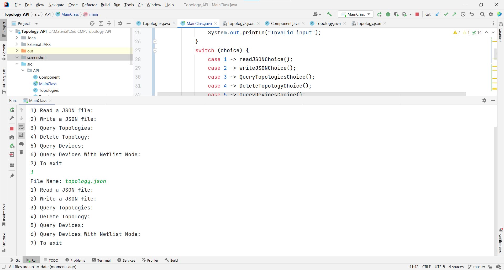
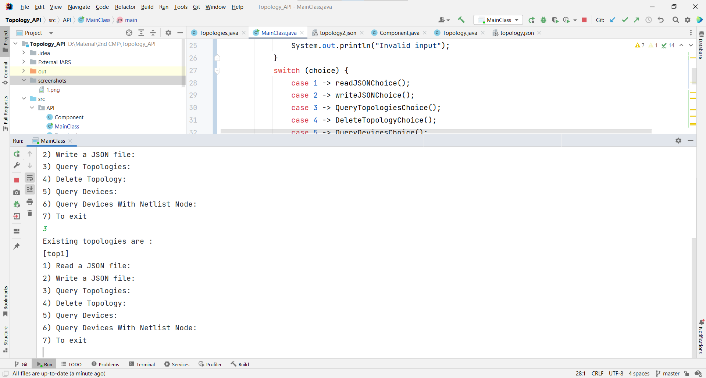
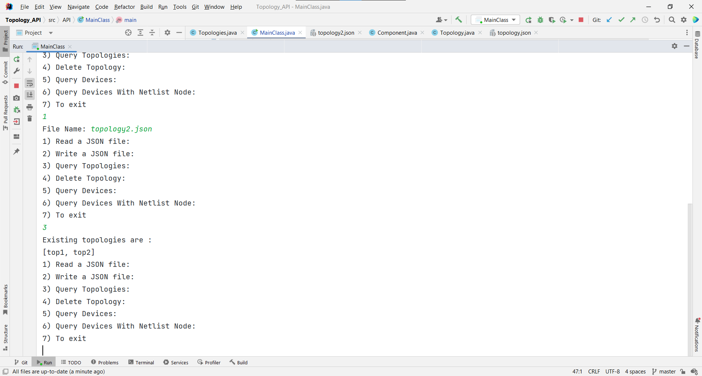
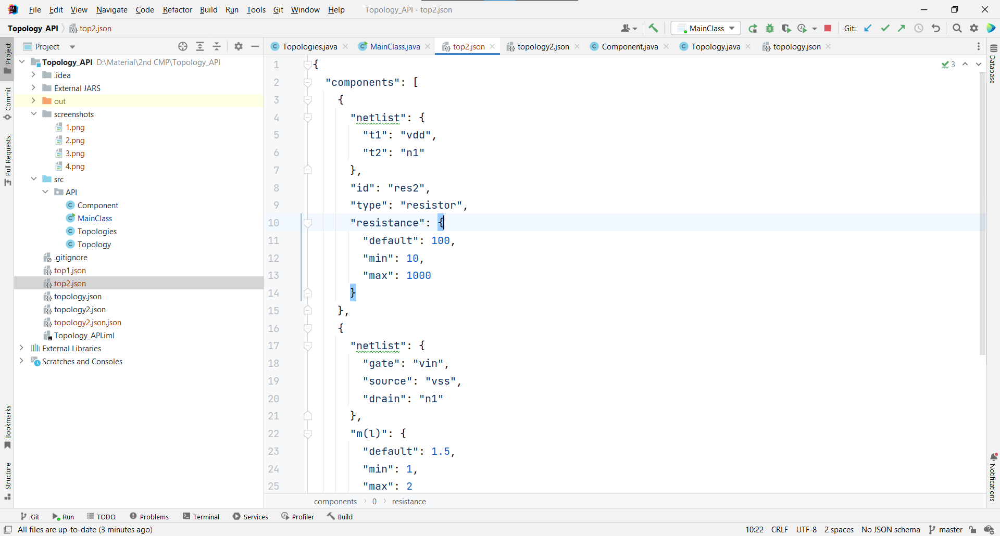
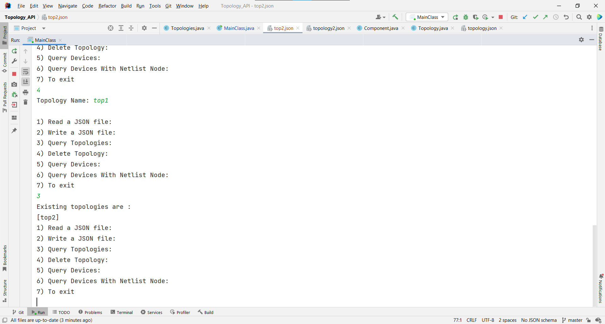
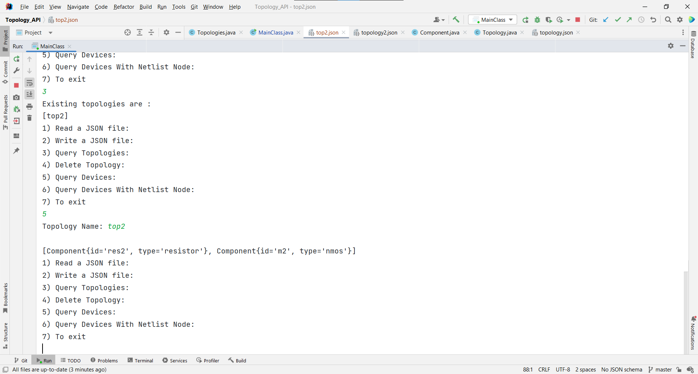
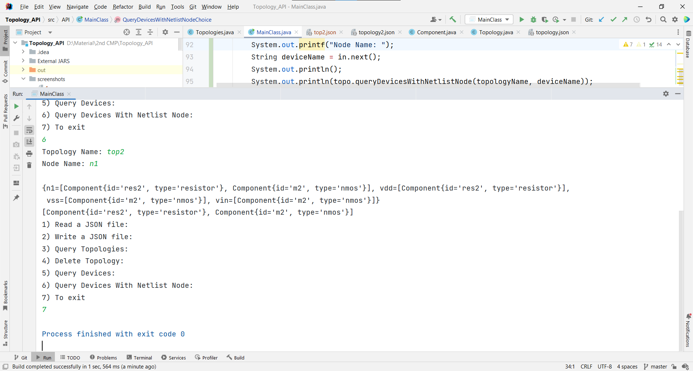
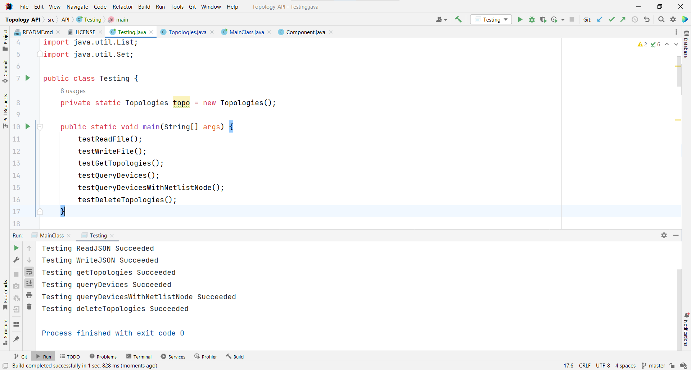

<div align="center">

# Topology API

</div>

<div align="center">

[](https://github.com/Abd-ELrahmanHamza/Topology_API/contributors)
[](LICENSE)
[](https://github.com/Abd-ELrahmanHamza/Topology_API/network)
[](https://github.com/Abd-ELrahmanHamza/Topology_API/stargazers)
[](https://github.com/Abd-ELrahmanHamza/Topology_API/issues)

</div>

Provide the functionality to access, manage and store device topologies.

## Description
1. Read a topology from a given JSON file and store it in the memory.
2. Write a given topology from the memory to a JSON file.
3. Query about which topologies are currently in the memory.
4. Delete a given topology from memory.
5. Query about which devices are in a given topology.
6. Query about which devices are connected to a given netlist node in
   a given topology.

## Getting Started

### Classes
#### MainClass

* This class contains the main function you need to run the API
* It creates an object from Topologies and call its functions

#### Topologies

Consists of Topologies

* This class contains the functions of the API :-
  * void readJSON(String fileName)
  * void writeJSON(String topologyID)
  * Set<String> getTopologies()
  * boolean deleteTopology(String topologyID)
  * List<Component> queryDevices(String topologyID)
  * List<Component> queryDevicesWithNetlistNode(String topologyID, String node)

#### Topology

Each topology consists of components and the JSON format of the topology

#### Component

Each component contains the ID and type of the component (Maybe extended if required)

#### Testing

This class tests each function of class Topologies

### Dependencies

* Java
* json.simple

### Installing

```
git clone https://github.com/Abd-ELrahmanHamza/Topology_API 
```

### Screenshots

#### Read JSON file


#### Query Topologies


#### Read JSON file & Query Topologies



#### Output File


#### Delete a topology & Query Topologies


#### Query devices in a topology


#### Query devices with netlist node then exit


#### Testing


## Contributors

<table>
<tr>
<td align="center">
<a href="https://github.com/Abd-ELrahmanHamza" target="_black">
<br /><sub><b>Abdelrahman Hamza</b></sub></a><br />
</td>
</tr>
 </table>

## License

This project is licensed under the [MIT] License - see the [LICENSE.md](LICENSE) file for details
